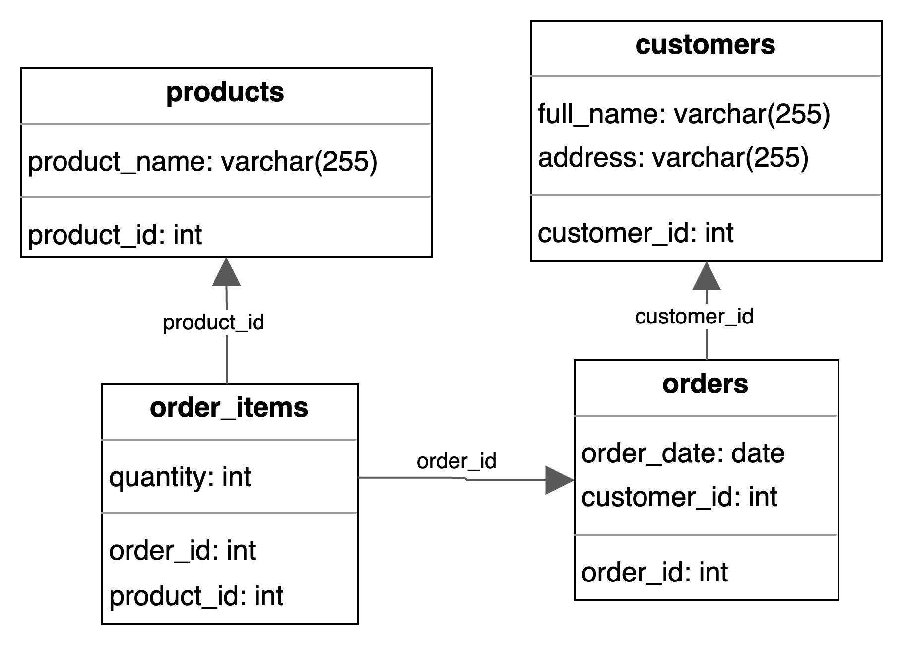

# Нормалізація таблиці замовлень

## Початкова таблиця (ненормалізована)

| Номер_замовлення | Назва_товару і кількість | Адреса_клієнта | Дата_замовлення | Клієнт     |
|------------------|---------------------------|----------------|-----------------|------------|
| 101              | Лептоп: 3, Мишка: 2       | Хрещатик 1     | 2023-03-15      | Мельник    |
| 102              | Принтер: 1                | Басейна 2      | 2023-03-16      | Шевченко   |
| 103              | Мишка: 4                  | Комп'ютерна 3  | 2023-03-17      | Коваленко  |

---

## 1НФ — Перша нормальна форма
### Таблиця `orders_1nf`

| Номер_замовлення | Назва_товару | Кількість | Адреса_клієнта | Дата_замовлення | Клієнт     |
|------------------|--------------|-----------|----------------|-----------------|------------|
| 101              | Лептоп       | 3         | Хрещатик 1     | 2023-03-15      | Мельник    |
| 101              | Мишка        | 2         | Хрещатик 1     | 2023-03-15      | Мельник    |
| 102              | Принтер      | 1         | Басейна 2      | 2023-03-16      | Шевченко   |
| 103              | Мишка        | 4         | Комп'ютерна 3  | 2023-03-17      | Коваленко  |

---

## 2НФ — Друга нормальна форма
### `orders`
| order_id (PK) | order_date | customer_name | customer_address |
|---------------|------------|---------------|------------------|
| 101           | 2023-03-15 | Мельник       | Хрещатик 1       |
| 102           | 2023-03-16 | Шевченко      | Басейна 2        |
| 103           | 2023-03-17 | Коваленко     | Комп'ютерна 3    |

### `products`
| product_id (PK) | product_name |
|-----------------|--------------|
| 1               | Лептоп       |
| 2               | Мишка        |
| 3               | Принтер      |

### `order_items`
| order_id (FK, PK) | product_id (FK, PK) | quantity |
|-------------------|---------------------|----------|
| 101               | 1                   | 3        |
| 101               | 2                   | 2        |
| 102               | 3                   | 1        |
| 103               | 2                   | 4        |

---

## 3НФ — Третя нормальна форма
### `customers`
| customer_id (PK) | full_name | address        |
|------------------|-----------|----------------|
| 1                | Мельник   | Хрещатик 1     |
| 2                | Шевченко  | Басейна 2      |
| 3                | Коваленко | Комп'ютерна 3  |

### `orders` (оновлена)
| order_id (PK) | order_date | customer_id (FK) |
|---------------|------------|------------------|
| 101           | 2023-03-15 | 1                |
| 102           | 2023-03-16 | 2                |
| 103           | 2023-03-17 | 3                |

### `products` (без змін)
| product_id (PK) | product_name |
|-----------------|--------------|
| 1               | Лептоп       |
| 2               | Мишка        |
| 3               | Принтер      |

### `order_items` (без змін)
| order_id (FK, PK) | product_id (FK, PK) | quantity |
|-------------------|---------------------|----------|
| 101               | 1                   | 3        |
| 101               | 2                   | 2        |
| 102               | 3                   | 1        |
| 103               | 2                   | 4        |

---

## Фінальна структура (4 таблиці)
**Кардинальності:**
- Один клієнт може мати багато замовлень (1:N)
- Одне замовлення містить багато позицій (1:N)
- Один товар може бути в багатьох позиціях замовлень (1:N)
- `order_items` — асоціативна таблиця для зв'язку N:M між `orders` і `products`

